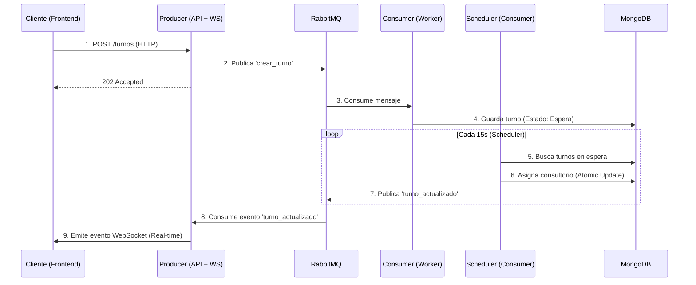

# IA_P1 - Sistema de Turnos Médicos en Tiempo Real

> Sistema de gestión de turnos médicos basado en **Microservicios**, **Event-Driven Architecture** y **WebSockets**.

## 🚀 Arquitectura y Flujo

El sistema desacopla la recepción de turnos de su procesamiento para garantizar alta disponibilidad y escalabilidad.



## 🧩 Servicios

| Servicio | Tecnología | Puerto | Responsabilidad |
|---|---|---|---|
| **Producer** | NestJS | `3000` | API Gateway, Validación de entrada, WebSocket Gateway,Swagger Documentation. |
| **Consumer** | NestJS | — | Procesamiento asíncrono, Scheduler de asignación, Persistencia en DB. |
| **Frontend** | Next.js | `3001` | Interfaz de usuario Reactiva, Cliente WebSocket, Diseño moderno. |
| **RabbitMQ** | RabbitMQ 3 | `5672` | Broker de mensajería (Colas: `turnos_queue`, `turnos_notifications`). |
| **MongoDB** | MongoDB 7 | `27017` | Base de datos NoSQL persistente. |

## 🛠️ Instalación y Ejecución

### Prerrequisitos
- Docker Engine & Docker Compose

### Pasos

1. **Clonar el repositorio**
   ```bash
   git clone https://github.com/Duver0/IA_P1.git
   cd IA_P1
   ```

2. **Iniciar la infraestructura**
   ```bash
   docker compose up -d --build
   ```

3. **Acceder a la aplicación**
   - **Frontend:** [http://localhost:3001](http://localhost:3001)
   - **API Swagger:** [http://localhost:3000/api/docs](http://localhost:3000/api/docs)
   - **RabbitMQ Admin:** [http://localhost:15672](http://localhost:15672) (user: `guest`, pass: `guest`)

## ✨ Características Clave

- **Event-Driven**: Comunicación asíncrona entre servicios para mayor resiliencia.
- **Real-Time**: Actualizaciones instantáneas en el frontend vía WebSockets (`socket.io`).
- **Concurrency Safe**: Asignación de turnos atómica (`findOneAndUpdate`) para prevenir race conditions.
- **Robustez**:
  - Manejo de errores tipado (`TurnoEventPayload`).
  - Validación de datos (DTOs + `class-validator`).
  - Logs estructurados (`NestJS Logger`).
- **Infraestructura como Código**: Entorno completamente dockerizado (`docker-compose.yml`).

## 📡 API Endpoints (Producer)

| Método | Endpoint | Descripción |
|---|---|---|
| `POST` | `/turnos` | Crear un nuevo turno (Async) |
| `GET` | `/turnos` | Listar todos los turnos |
| `GET` | `/turnos/:cedula` | Buscar turnos por cédula |

## 🧪 Pruebas Manuales (cURL)

**Crear un turno:**
```bash
curl -X POST http://localhost:3000/turnos \
  -H "Content-Type: application/json" \
  -d '{"nombre": "Paciente Test", "cedula": 12345, "priority": "alta"}'
```

**Ver respuesta:**
```json
{
  "status": "accepted",
  "message": "Turno en proceso de asignación"
}
```

## 📂 Estructura del Proyecto

```
IA_P1/
├── backend/
│   ├── producer/        # API Gateway & WebSocket Server
│   │   ├── src/events/  # Controladores de eventos (RabbitMQ -> WS)
│   │   └── src/turnos/  # Lógica de negocio HTTP
│   └── consumer/        # Worker Service
│       ├── src/scheduler/ # Lógica de asignación automática
│       └── src/turnos/    # Persistencia MongoDB
├── frontend/            # Next.js App Router
│   ├── src/hooks/       # Custom Hooks (useTurnosWebSocket)
│   └── src/domain/      # Modelos compartidos
├── docker-compose.yml   # Orquestación de contenedores
└── README.md            # Documentación
```

## 📝 Notas de Auditoría (Fixes recientes)

- **Type Safety**: Se eliminaron los tipos `any` mediante interfaces compartidas (`TurnoEventPayload`).
- **Race Conditions**: Se corrigió la lógica del scheduler para garantizar asignaciones únicas.
- **Frontend Sync**: Se ajustaron los tipos (`cedula: number`) para coincidir con el backend.
- **Docker Networking**: Configuración corregida para que el cliente navegador use `localhost`.