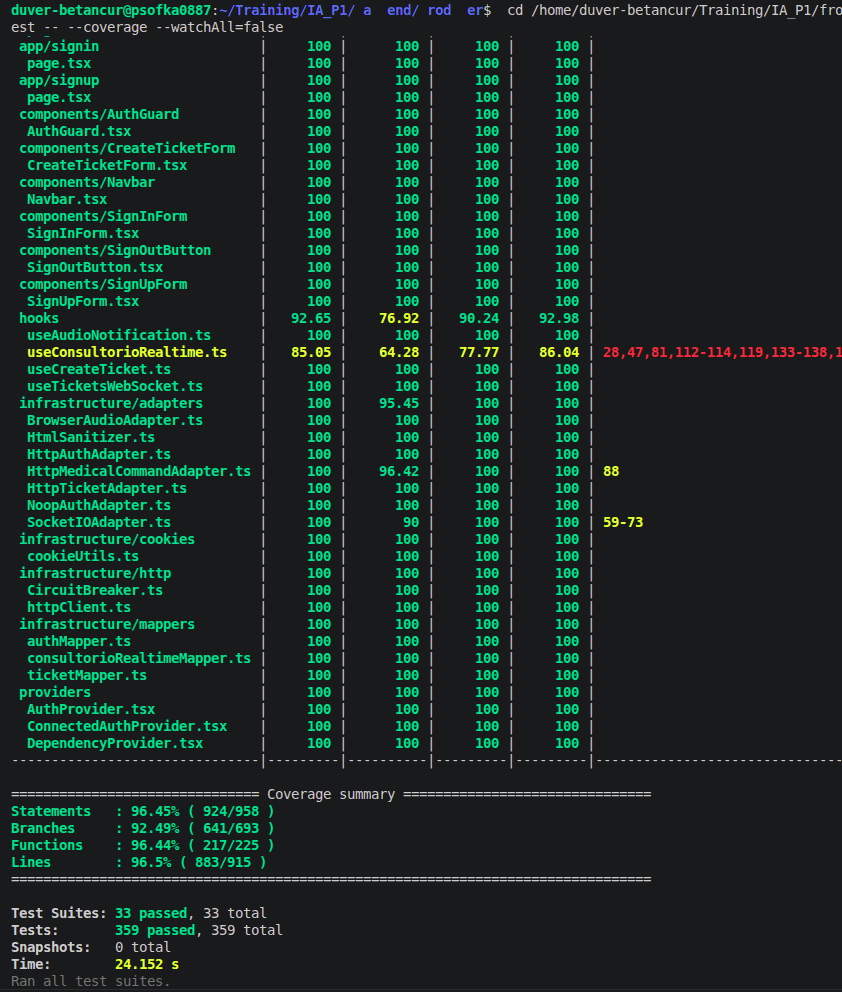
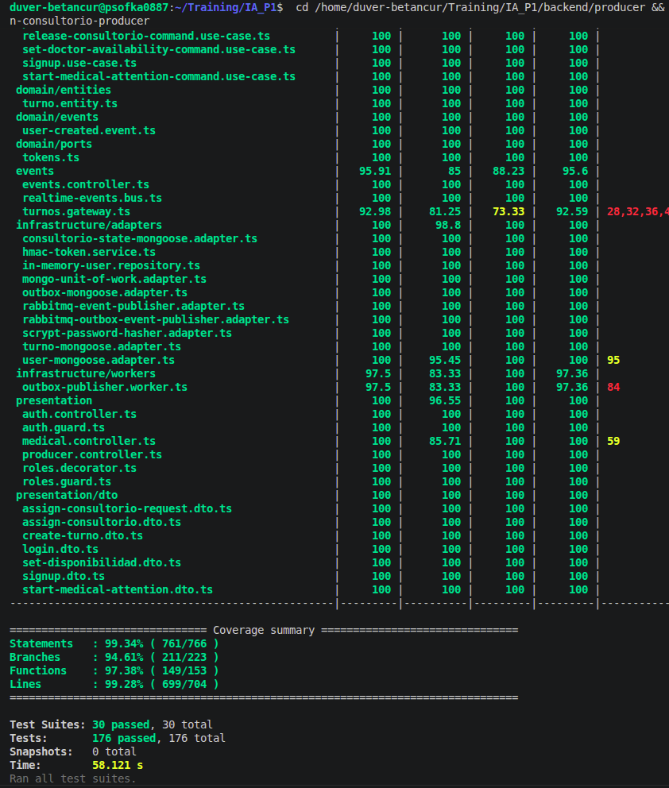
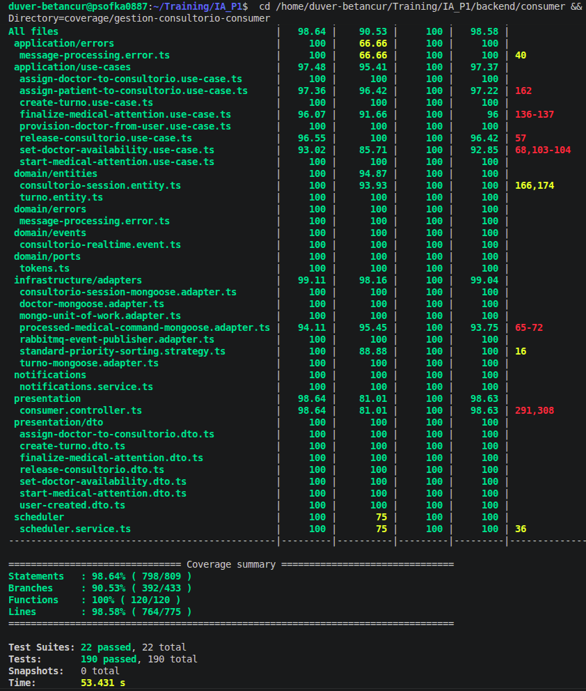

# TESTING_STRATEGY_GESTION_CONSULTORIO.md

Documento de consolidacion de la estrategia de pruebas para la feature de gestion de consultorio y sesion medica, ya implementada en el sistema.

Fecha de corte: 2026-04-06
Estado: Implementado y validado en CI

---

## 1) Objetivo

Definir una estrategia de pruebas trazable para confirmar que el flujo medico cumple reglas de negocio y contratos tecnicos, desde autenticacion por rol hasta cierre de atencion y liberacion de consultorio.

---

## 2) Alcance funcional de la feature

La estrategia cubre las capacidades implementadas:

- Autenticacion y autorizacion por rol medico.
- Toma y liberacion de consultorio por medico autenticado.
- Gestion de disponibilidad del medico.
- Inicio y finalizacion manual de atencion.
- Sincronizacion de estado en tiempo real (consultorio y turno).
- Bloqueo de acciones invalidas segun estado.
- Manejo de comandos con idempotencia por commandId.

Fuera de alcance en este documento:

- Pruebas de carga y estres.
- Pruebas visuales de UI no funcionales.
- Benchmark de rendimiento de infraestructura.

---

## 3) Enfoque de calidad

Se aplica el principio: verificar primero (correctitud tecnica), validar despues (reglas de negocio).

- Verificar: contratos por capa y transiciones de estado validas/invalidas.
- Validar: recorrido real del medico, restricciones de acceso y coherencia del flujo operativo.

---

## 4) Estrategia por niveles

### 4.1 Nivel 1 - White-Box (regla aislada)

Objetivo: asegurar reglas criticas en unidades acotadas.

Cobertura esperada:

- Dominio y mapeo de payload de turnos.
- Casos de uso de comandos medicos.
- DTOs y validaciones de entrada.
- Adaptadores de persistencia y estado de consultorio.

### 4.2 Nivel 2 - Component tests (frontend y capas aisladas)

Objetivo: validar comportamiento funcional en componentes y modulos con dependencias mockeadas.

Cobertura esperada:

- Vista medico y acciones por estado.
- AuthGuard, Provider de autenticacion y rutas protegidas.
- Adaptadores HTTP y mappers.
- Mensajeria de UI para acciones permitidas y bloqueadas.

### 4.3 Nivel 3 - Integration tests (black-box tecnico)

Objetivo: validar integracion entre capas y contratos de infraestructura.

Cobertura esperada:

- Producer: controladores, gateway y bus de eventos realtime.
- Consumer: procesamiento de eventos, estados y consistencia operativa.
- Frontend: adaptadores de infraestructura en integracion.

### 4.4 Nivel 4 - Acceptance (black-box de negocio)

Objetivo: comprobar escenarios completos orientados a negocio.

Cobertura esperada:

- Flujo de ingreso medico -> toma consultorio -> atencion -> finalizacion -> liberacion.
- Rechazo de acceso sin rol medico.
- Bloqueo de acciones fuera de secuencia.
- Escenarios de no disponibilidad sin romper atencion activa.

---

## 5) Matriz de riesgos y prioridad

| Riesgo | Impacto | Probabilidad | Cobertura principal |
|---|---|---|---|
| Acceso no autorizado al panel medico | Alto | Media | AuthGuard + tests de roles |
| Doble asignacion de consultorio | Alto | Media | Casos de uso + integration producer/consumer |
| Transiciones invalidas de estado | Alto | Alta | Unit tests de reglas + component tests medico |
| Inconsistencia realtime de estado | Alto | Media | Integration gateway/events + frontend realtime |
| Cierre de atencion fuera de secuencia | Alto | Media | Use cases + acceptance de flujo completo |

---

## 6) Evidencia de ejecucion en CI

Estado observado en pipeline:

- Lint & Typecheck: OK
- Component Tests (White-Box): OK
- Integration Tests (Black-Box): OK
- Docker Build & Security Scan: OK

---

## 7) Espacios para pantallazos de coverage

Instruccion:

- Guardar imagenes en docs/img.
- Mantener los nombres sugeridos para evitar romper enlaces.
- Reemplazar cada bloque cuando se tenga el pantallazo oficial.

### 7.1 Coverage Frontend (feature gestion consultorio)

Ruta esperada: docs/img/coverage_frontend_gestion_consultorio.png

### 7.2 Coverage Producer (feature gestion consultorio)

Ruta esperada: docs/img/coverage_producer_gestion_consultorio.png

### 7.3 Coverage Consumer (feature gestion consultorio)

Ruta esperada: docs/img/coverage_consumer_gestion_consultorio.png

---

## 8) Criterios de salida

Para considerar el feature listo:

- Sin errores de lint y typecheck en CI.
- Suites de componentes e integracion en estado verde.
- Escenarios criticos de negocio sin fallos abiertos de severidad alta.
- Evidencias de coverage cargadas en docs/img y visibles desde este documento.

---

## 9) Trazabilidad documental

Documentos relacionados:

- TEST_PLAN_GESTION_CONSULTORIO.md
- AI_WORKFLOW.md
- TEST_PLAN.md

Version: 1.0
