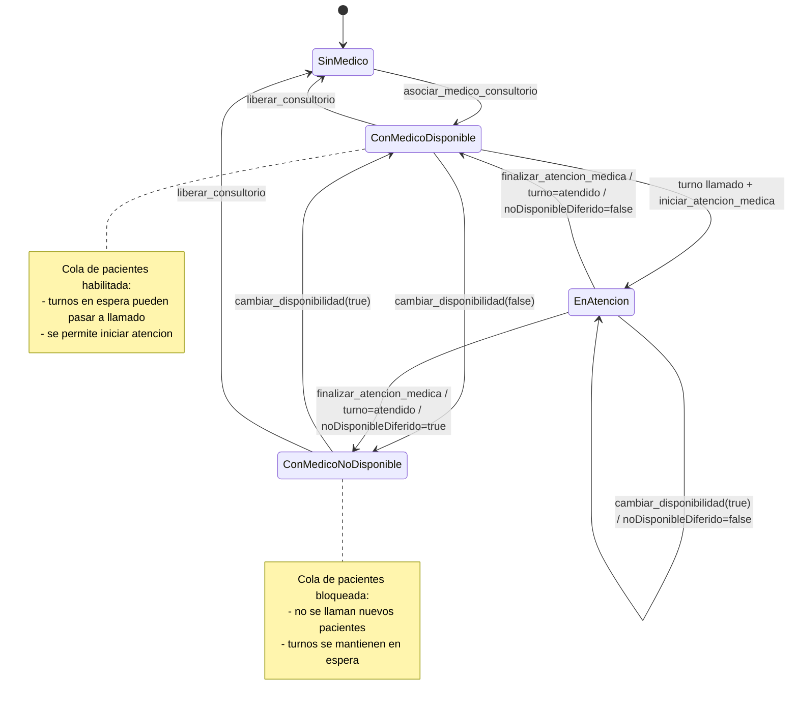
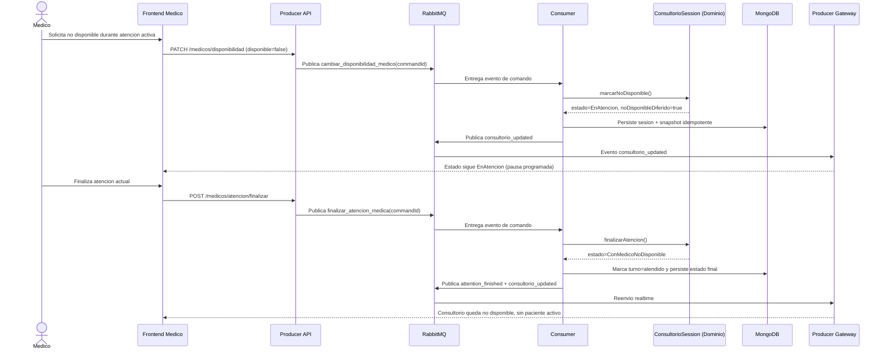

# Diagramas de la Feature: Gestion de Consultorio y Sesion Medica

Documento de soporte visual para sustentacion tecnica y funcional.

Fecha: 2026-04-08

---

## 1) Diagrama de estado completo (consultorio + cola + turno)



---

## 2) Diagrama arquitectonico de la feature en el sistema

```mermaid
flowchart LR
    subgraph UI[Frontend Next.js]
        MP[Pagina Medico]
        RTH[Hook useConsultorioRealtime]
        GUARD[AuthGuard]
    end

    subgraph PROD[Producer NestJS]
        REST[REST Controllers medicos y consultorios]
        UCMD[Use Cases de comandos]
        PPORT[Puertos de salida producer]
        P_ADAPT[RabbitMQ Publisher Adapter]
        STATE_R[Consultorio State Reader Adapter]
        GATE[TurnosGateway WebSocket]
    end

    subgraph MQ[RabbitMQ]
        Q1[(turnos_queue)]
        Q2[(eventos de dominio)]
    end

    subgraph CONS[Consumer NestJS]
        EVH[ConsumerController EventPattern]
        CORE[Dominio ConsultorioSession + Use Cases]
        CPORT[Puertos de salida consumer]
        C_ADAPT[Mongoose Adapters + Event Publisher]
    end

    subgraph DB[(MongoDB)]
        COLL1[(consultoriosessions)]
        COLL2[(turnos)]
        COLL3[(doctors)]
        COLL4[(processedmedicalcommands)]
    end

    MP --> GUARD
    MP --> REST
    RTH --> GATE

    REST --> UCMD
    UCMD --> PPORT
    PPORT --> P_ADAPT
    PPORT --> STATE_R

    P_ADAPT --> Q1
    Q1 --> EVH
    EVH --> CORE
    CORE --> CPORT
    CPORT --> C_ADAPT

    C_ADAPT --> COLL1
    C_ADAPT --> COLL2
    C_ADAPT --> COLL3
    C_ADAPT --> COLL4
    C_ADAPT --> Q2

    Q2 --> GATE
    GATE --> RTH
```

---

## 3) Diagrama de secuencia: no disponible durante atencion activa (intencion diferida)



---

## 4) Nota de uso en sustentacion

Orden recomendado para explicar:

1. Estado completo para reglas de negocio.
2. Arquitectura para hexagonal y fronteras de puertos/adaptadores.
3. Secuencia para justificar intencion diferida y consistencia eventual.

