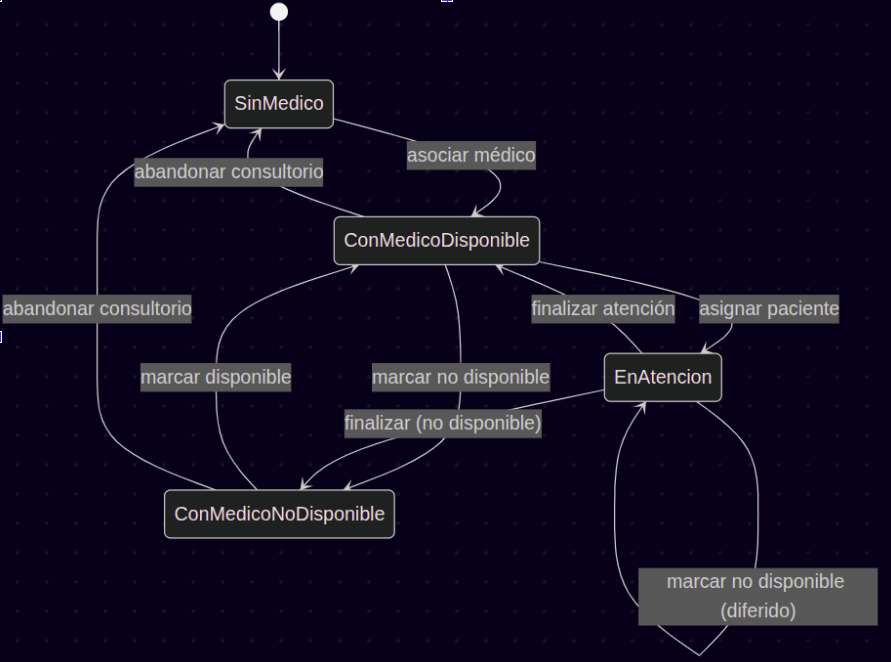
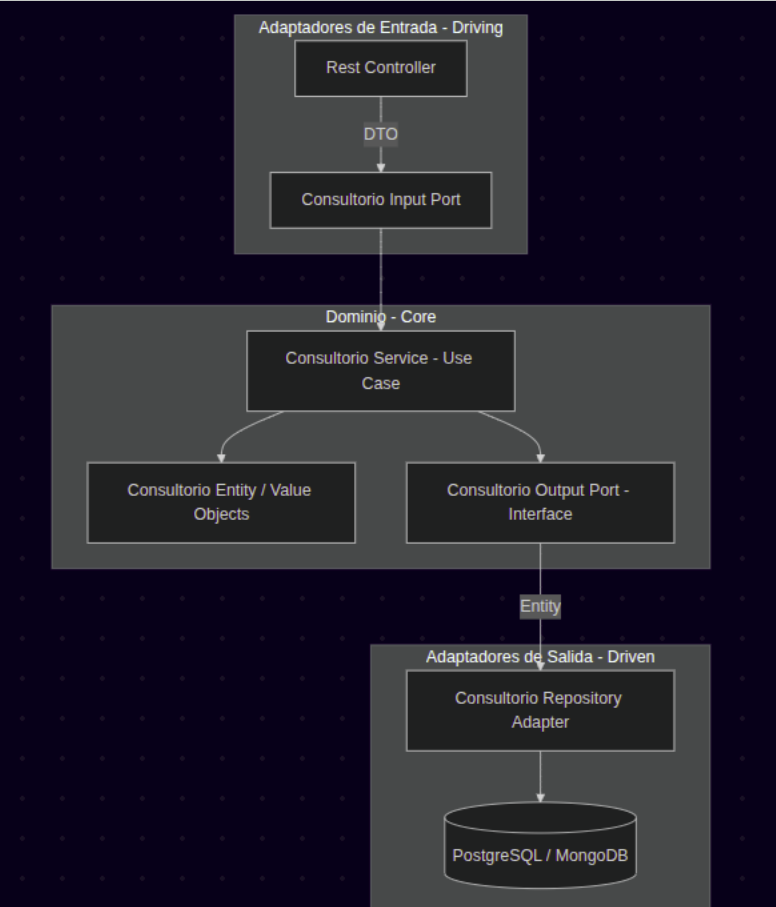
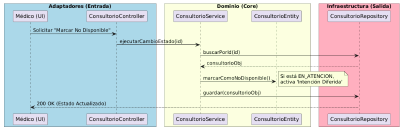
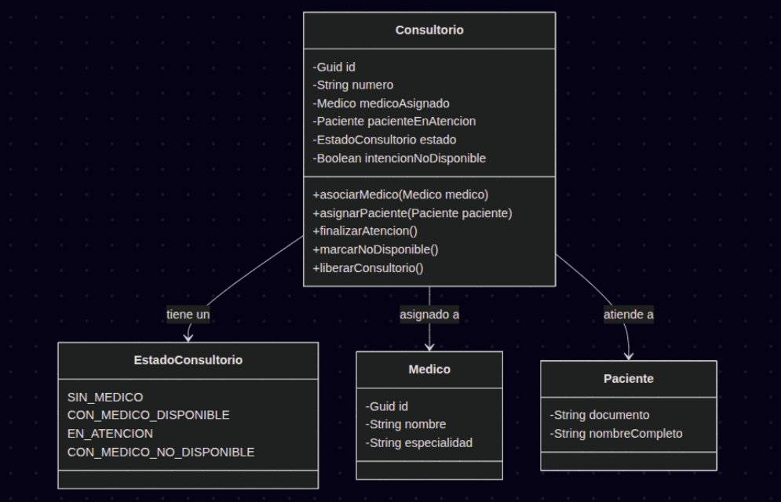

# Diseño Arquitectónico

## Gestión de consultorio y sesión médica

---

## Descripción del problema

El sistema actual de atención médica opera bajo un modelo simulado basado en temporizadores que determinan la duración de las consultas y la liberación automática de los consultorios. Esto tiene varias limitaciones:

- No refleja una interacción real donde el médico controla la atención del paciente  
- No existe un médico como actor del sistema  
- Las asignaciones de pacientes no se apegan a una realidad operativa  
- No se contemplan escenarios como:
  - Finalización anticipada  
  - Interrupción  
  - Cancelación  

---

## Feature / Épica

Se propone un flujo de atención médica controlado por el médico como actor principal:

- Autenticación basada en roles  
- Asociación exclusiva a consultorio  
- Control explícito de disponibilidad  
- Visualización en tiempo real del paciente  
- Gestión de inicio y fin de atención  

---

## Historias de Usuario

## HU-01: Autenticación de Personal
**Como** médico  
**Quiero** iniciar sesión en el sistema  
**Para** acceder a las funcionalidades de gestión de consultorios restringidas a mi rol  

### Criterios de Aceptación

#### Scenario: Inicio de sesión exitoso
- **Given** un usuario con credenciales válidas y rol médico  
- **When** intenta iniciar sesión  
- **Then** el sistema permite el acceso  

#### Scenario: Inicio de sesión con credenciales inválidas
- **Given** un usuario con credenciales inválidas  
- **When** intenta iniciar sesión  
- **Then** el sistema rechaza el acceso  
- **And** retorna un mensaje de error de autenticación  

#### Scenario: Acceso sin rol médico
- **Given** un usuario autenticado con rol diferente a médico  
- **When** intenta acceder a la gestión de consultorios  
- **Then** el sistema deniega el acceso  
- **And** retorna un error de autorización  

---

## HU-02: Selección de Consultorio
**Como** médico autenticado  
**Quiero** vincularme a un consultorio disponible  
**Para** atender pacientes desde un punto físico definido  

### Criterios de Aceptación

#### Scenario: Asociación exitosa a consultorio
- **Given** un médico autenticado sin consultorio asignado  
- **And** existe un consultorio en estado `SinMedico`  
- **When** selecciona el consultorio  
- **Then** el sistema lo asocia exitosamente  
- **And** el consultorio cambia a estado `ConMedicoDisponible`  

#### Scenario: Consultorio ocupado
- **Given** un médico autenticado sin consultorio asignado  
- **And** el consultorio está asociado a otro médico  
- **When** intenta seleccionarlo  
- **Then** el sistema rechaza la acción  

#### Scenario: Médico ya tiene consultorio activo
- **Given** un médico con un consultorio en estado `ConMedicoDisponible`  
- **When** intenta seleccionar otro consultorio  
- **Then** el sistema impide la acción  

#### Scenario: Consultorio no disponible
- **Given** un médico autenticado sin consultorio asignado  
- **And** el consultorio está en estado `ConMedicoNoDisponible`  
- **When** intenta seleccionarlo  
- **Then** el sistema no permite la asociación  

#### Scenario: Asignación de paciente a consultorio disponible
- **Given** un consultorio en estado `ConMedicoDisponible`  
- **And** existen pacientes en espera  
- **When** el sistema asigna un paciente  
- **Then** el consultorio cambia a estado `EnAtencion`  

#### Scenario: Liberar consultorio
- **Given** un médico con un consultorio en estado `ConMedicoDisponible`  
- **When** el médico abandona el consultorio  
- **Then** el consultorio cambia a estado `SinMedico`  

---

## HU-03: Visualización de paciente en atención
**Como** médico en un consultorio activo  
**Quiero** visualizar la información básica del paciente asignado  
**Para** realizar la atención médica informado  

### Criterios de Aceptación

#### Scenario: Visualizar paciente asignado
- **Given** un médico con consultorio en estado `EnAtencion`  
- **When** accede a la vista de atención  
- **Then** el sistema muestra nombre y documento del paciente  

#### Scenario: Sin paciente asignado
- **Given** un médico con consultorio en estado `ConMedicoDisponible`  
- **When** accede a la vista de atención  
- **Then** el sistema indica que no hay paciente en atención  

---

## HU-04: Gestión de disponibilidad
**Como** médico en un consultorio activo  
**Quiero** marcar mi consultorio como no disponible  
**Para** evitar la asignación de nuevos turnos mientras estoy fuera de servicio  

### Criterios de Aceptación

#### Scenario: Marcar consultorio como no disponible
- **Given** un médico con consultorio en estado `ConMedicoDisponible`  
- **When** marca el consultorio como no disponible  
- **Then** el consultorio cambia a estado `ConMedicoNoDisponible`  

#### Scenario: No asignar pacientes cuando no está disponible
- **Given** un consultorio marcado como no disponible  
- **And** existen pacientes en espera  
- **When** el sistema intenta asignar un paciente  
- **Then** el paciente no es asignado a ese consultorio  

#### Scenario: Volver a disponible
- **Given** un consultorio en estado `ConMedicoNoDisponible`  
- **When** el médico lo marca como disponible  
- **Then** el consultorio cambia a estado `ConMedicoDisponible`  

#### Scenario: No interrumpir atención activa
- **Given** un médico con consultorio en estado `EnAtencion`  
- **When** marca el consultorio como no disponible  
- **Then** el consultorio mantiene el estado `EnAtencion`  
- **And** el consultorio registra una intención de cambio a estado `ConMedicoNoDisponible` al finalizar la atención  

---

## HU-05: Finalización de atención
**Como** médico en un consultorio con un paciente asignado  
**Quiero** finalizar la atención del paciente  
**Para** permitir la continuidad del flujo de atención  

### Criterios de Aceptación

#### Scenario: Finalizar atención cuando el consultorio está marcado como no disponible
- **Given** un médico con consultorio en estado `EnAtencion`  
- **And** el consultorio está marcado como no disponible  
- **When** finaliza la atención  
- **Then** el sistema registra la finalización  
- **And** el consultorio cambia a estado `ConMedicoNoDisponible`  

#### Scenario: Abandonar consultorio sin atención activa
- **Given** un médico con consultorio en estado `ConMedicoNoDisponible`  
- **When** abandona el consultorio  
- **Then** el consultorio cambia a estado `SinMedico`  

#### Scenario: Intentar finalizar sin paciente
- **Given** un médico con consultorio en estado `ConMedicoDisponible`  
- **When** intenta finalizar la atención  
- **Then** el sistema rechaza la acción  

#### Scenario: Remover paciente de la vista
- **Given** un consultorio en estado `ConMedicoDisponible`  
- **When** se actualiza la vista del consultorio  
- **Then** el paciente deja de aparecer  

#### Scenario: Intentar abandonar consultorio con atención activa
- **Given** un médico con consultorio en estado `EnAtencion`  
- **When** intenta abandonar el consultorio  
- **Then** el sistema rechaza la acción  

---

## Requerimientos Funcionales

- RF-01: Validación de credenciales y rol  
- RF-02: Asociación exclusiva médico-consultorio  
- RF-03: Asignación de pacientes solo si está disponible  
- RF-04: Actualización de estado en tiempo real  
- RF-05: Liberación post-atención  
- RF-06: Bloqueo de asignación si no está disponible  

---

## Modelo de Estados del Consultorio

- SinMedico
- ConMedicoDisponible
- EnAtencion
- ConMedicoNoDisponible

---

## Diagrama de Estado

---

## Diagrama Arquitectónico

---

## Diagrama de Secuencia

---

## Diagrama de Clases

---

## Cronograma (Planning Poker)

| Ítem | Descripción | Horas | Story Points |
|------|------------|------|-------------|
| 1 | Dominio y Value Objects | 8–12 | 8 |
| 2 | Puertos (interfaces) | 2–3 | 2 |
| 3 | Casos de uso | 6–8 | 5 |
| 4 | Persistencia | 5–8 | 5 |
| 5 | Adaptador de entrada | 4–5 | 3 |
| 6 | Pruebas unitarias | 6–8 | 5 |
